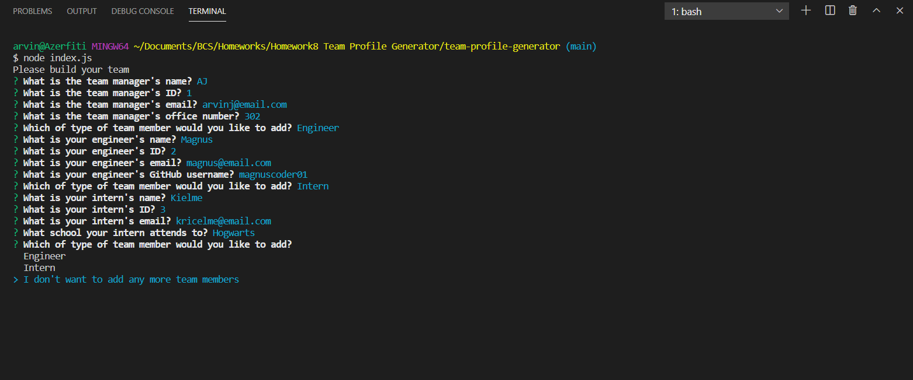
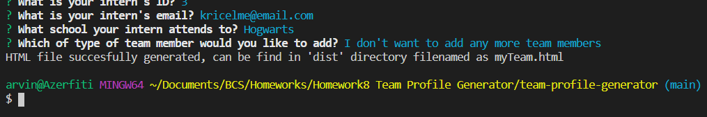
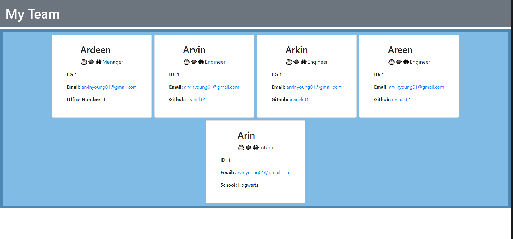

# 10 Object-Oriented Programming: Team Profile Generator

## Description
This is a command-line application that takes in information about employees on a software engineering team, then generates an HTML webpage that displays summaries for each person. This application is using Jest for running the unit tests and Inquirer for collecting input from the user.

## Table of Contents

* [Installation](#installation)

* [Tests](#tests)

* [Usage](#usage)

* [Screenshots](#screenshots)

* [Demo](#demo)

* [Acknowledgements](#acknowledgements)

## Installation

Run dependencies:

```bash
npm i
```

## Tests

```bash
npm test
```

## Usage

The application will be invoked by using the following command:

```bash
node index.js
```

## Screenshots

- A sample for the command-line application.  

- A message will be logged upon succesful output file generation.  

- This is the sample HTML file.  


## Demo

- A link for an instructional demonstration of the command-line app. 
NOT YET

## Acknowledgements
- Mr. John
- Mr. Luis
- Would like to commend the following persons for helping directly(guiding me what to do next)/indirectly(asking questions that I'm not aware of):
  - Oliver Shi
  - William Lucht
  - Tyler Abegg
  - Steven LeValley